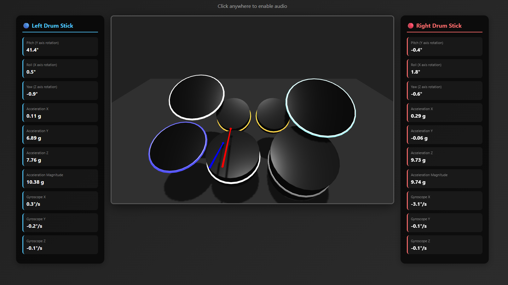
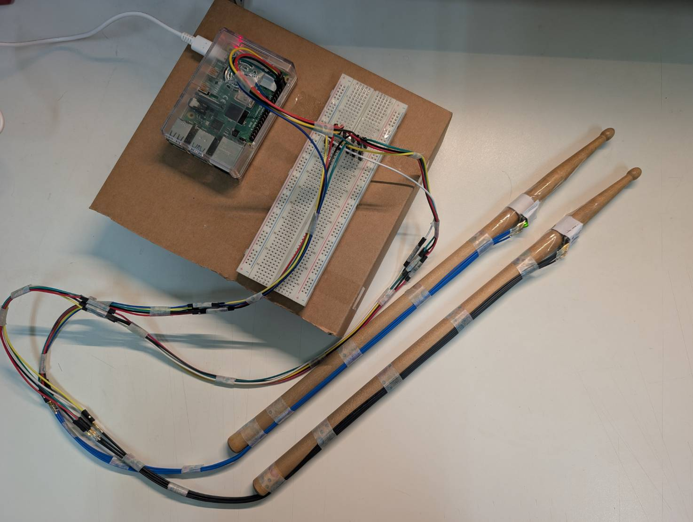
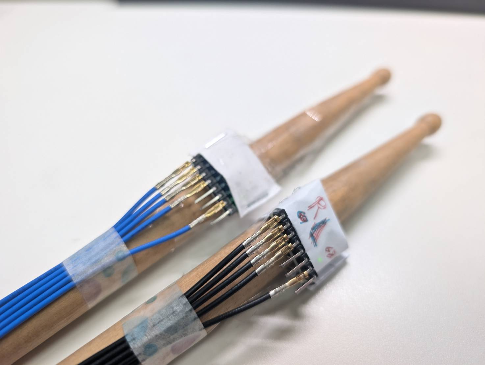
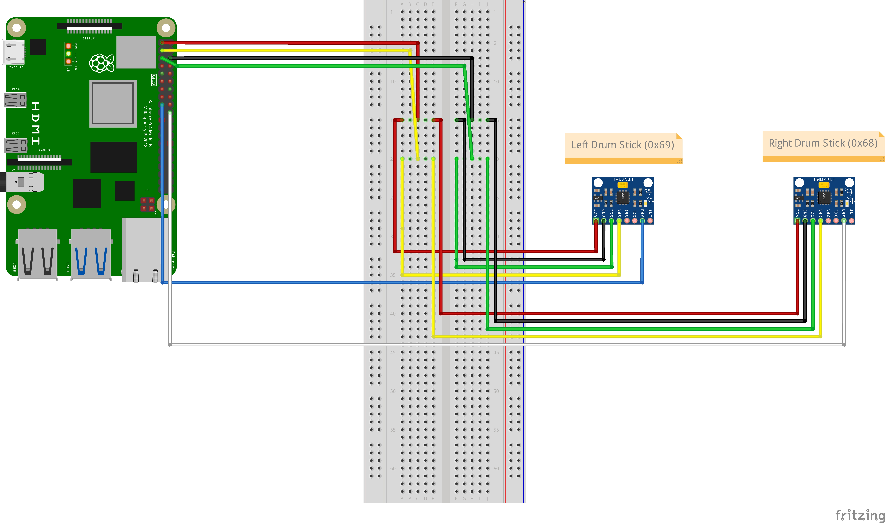
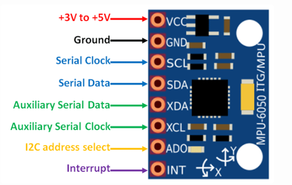
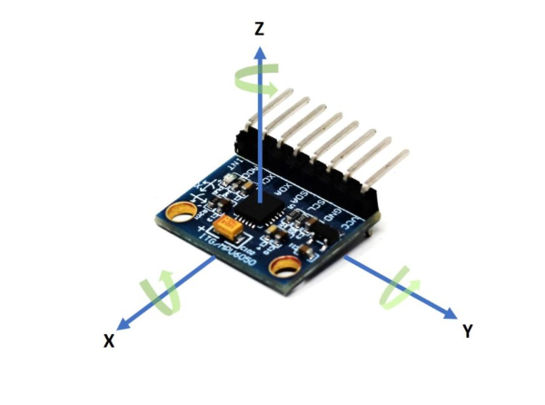

# IOT Drum Set
This is a personal project in IM5032 - Practical Internet of Things.  
Drums are not like guitar which can be easily portable, and the exsisting air drumstick is pretty expensive, so this project aims to implement an easy air drumstick using **Rasberry Pi4** and **mpu6050 sensor**.

  
  
  <!--  -->

## Required Components
| Item | Quantity | Purpose |
|-----|----------|---------|
| Raspberry Pi 4  | 1 | Main controller for data processing and system control |
| MPU6050  | 2 | Detect drumstick motion |
| Drumstick | 2 | Otherwise it can't be an air drumstick : ) |
| Breadboard | 1 | For better wiring |
| Jumper wires  | many | Connect MPU6050 to Raspberry Pi GPIO |
| Tape  | many | Make everything neat |

## Circuit Diagram

  

## Getting Start
### 1. Environment Setup

### 2. MPU6050 Sensor Setup

This is how it looks like. The three axsis is for detecting movment in all directions.  
Make sure to remember the relations between the sensor axsis and the reality direction.

  
  

 
 

First, go to the configeration in Rasberry Pi, enable SPI.

Run the following command to install I2C to detect the sensor:  
`sudo apt-get install i2c-tools`

Simply follow each step on this site:  
[Raspberry Pi MPU-6050 Tutorial](https://atceiling.blogspot.com/2017/02/raspberry-pi-mpu-6050.html)
