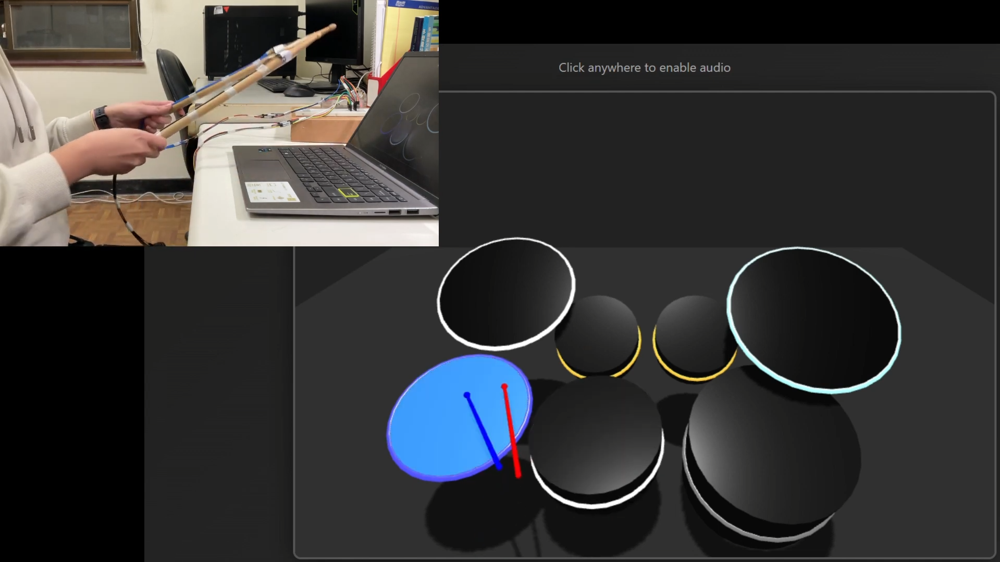
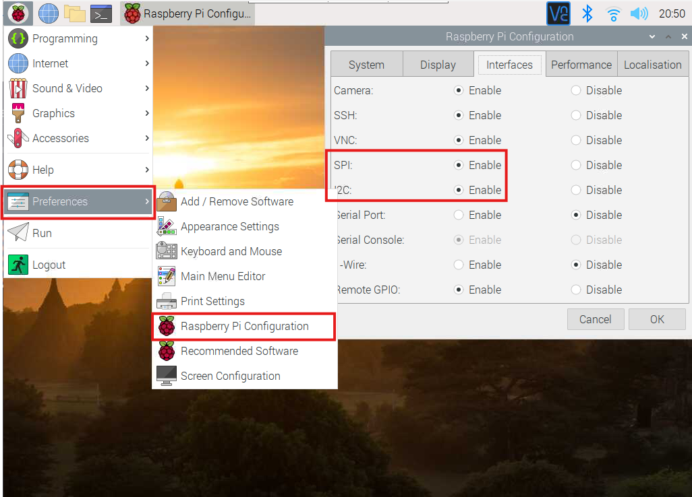
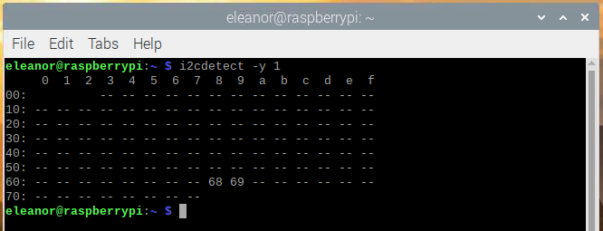
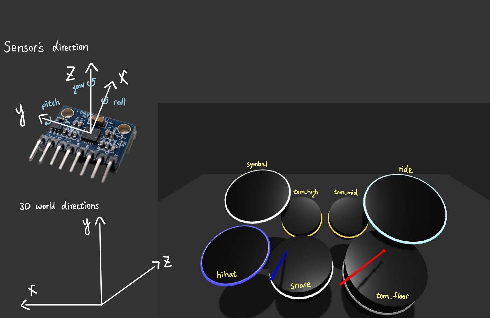
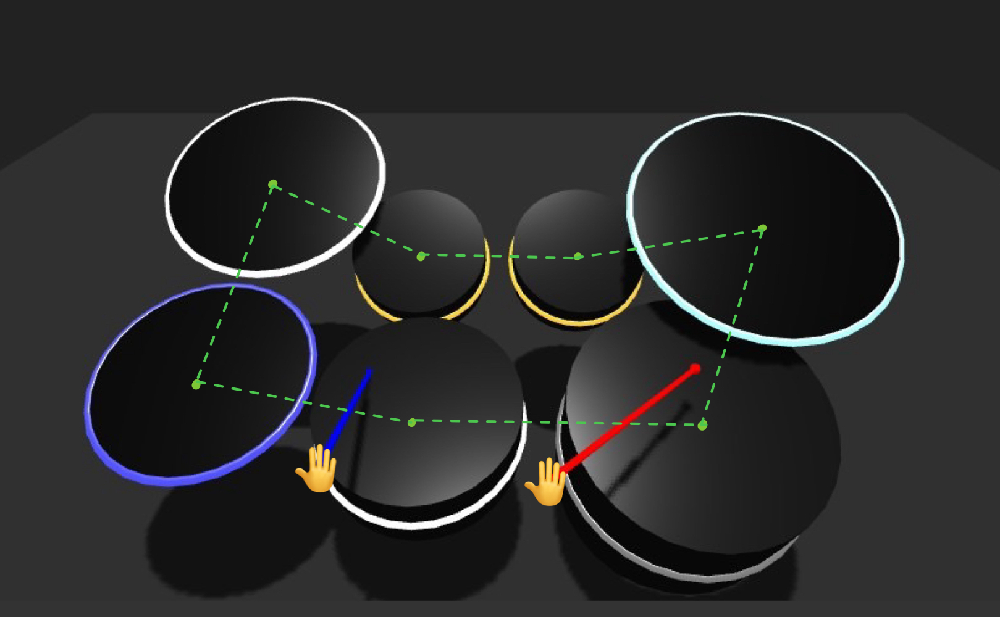

# IOT Drum Set
This is a personal project in IM5032 - Practical Internet of Things.  
Drums are not like guitar which can be easily portable, and the exsisting air drumstick is pretty expensive, so this project aims to implement an easy air drumstick using **Rasberry Pi4** and **mpu6050 sensor**.  
**Most of the code were generated by Claude and Gemini**

<div align="center">
  
  
</div>

## Demo Video

[](https://youtu.be/Q8ORrFAGLZA?si=hhA_naFbbZAaaGCb)

## Required Components
| Item | Quantity | Purpose |
|-----|----------|---------|
| Raspberry Pi 4  | 1 | Main controller for data processing and system control |
| MPU6050  | 2 | Detect drumstick motion |
| Drumstick | 2 | Otherwise it can't be an air drumstick : ) |
| Breadboard | 1 | For better wiring |
| Jumper wires  | many | Connect MPU6050 to Raspberry Pi GPIO |
| Tape  | many | Make everything neat |

## Circuit Diagram
<div align="center">
  
</div>


## Getting Start
### 1. Environment Setup

#### Install System Dependencies
```bash
sudo apt-get update
sudo apt-get install i2c-tools python3-smbus ffmpeg
```

#### Required Python Packages
`flask`  `flask-cors`  `smbus2`  `mpu6050-raspberrypi`  `flask-socketio`  `python-socketio`  `eventlet`  

---

### 2. MPU6050 Sensor Setup

This section explains how to connect **one or two MPU6050 sensors** to a Raspberry Pi.

The MPU6050 is a 6-axis IMU sensor (3-axis accelerometer + 3-axis gyroscope), which can detect movement and rotation in all directions.  
It is important to understand the relationship between the sensor axes and real-world directions, as this directly affects motion interpretation.

<div align="center" style="display: flex; gap: 10px;">
  
  
</div>

<br>
<br>

#### Enable I2C Interface

First, open the Raspberry Pi configuration tool and enable **I2C** and **SPI**:



#### Install I2C Tools and Detect Sensor

Install I2C tools:

    sudo apt-get install i2c-tools

Check whether the Raspberry Pi can detect the sensor:

    i2cdetect -y 1

If your Raspberry Pi uses a different I2C bus, try:

    i2cdetect -y 0

If `0x68` or `0x69` appears as shown below, the sensor is successfully detected.



#### Connecting One MPU6050 Sensor

By default, the MPU6050 uses I2C address `0x68`.

| MPU6050 | Raspberry Pi |
|--------|--------------|
| VCC    | 3.3V / 5V    |
| GND    | GND          |
| SDA    | GPIO 2       |
| SCL    | GPIO 3       |
| AD0    | GND          |

After wiring, run `i2cdetect -y 1`.  If `0x68` appears, the sensor is connected correctly.

#### Connecting Two MPU6050 Sensors

To connect two MPU6050 sensors on the same I2C bus, their I2C addresses must be different.

- Sensor 1: `AD0 → GND` → Address `0x68`
- Sensor 2: `AD0 → VCC` → Address `0x69`

Both sensors share the same SDA and SCL lines.

| Signal | Sensor 1 | Sensor 2 | Raspberry Pi |
|--------|----------|----------|--------------|
| VCC    | VCC      | VCC      | 3.3V / 5V    |
| GND    | GND      | GND      | GND          |
| SDA    | SDA      | SDA      | GPIO 2       |
| SCL    | SCL      | SCL      | GPIO 3       |
| AD0    | GND      | VCC      | —            |

After wiring, run `i2cdetect -y 1`.
You should see **both `0x68` and `0x69`**, indicating that two sensors are detected successfully.

You can also refer to the following tutorial for more details:  [https://atceiling.blogspot.com/2017/02/raspberry-pi-mpu-6050.html](https://atceiling.blogspot.com/2017/02/raspberry-pi-mpu-6050.html)


---


### 3. Calibrate Sensor Data
The offset values were obtained by collecting data while the sensors were **stationary and flat** on a table, then calculating the average error over multiple samples.

**Method:**

1. **Place the sensor flat on a stable surface** (drumstick lying horizontally on a table)

2. **Run the test script**  `mpu6050_test.py` to collect raw data. This script will record 100-200 samples of raw accelerometer and gyroscope readings while stationary

3. **Calculate  the average values** and the offest values of each sensor will be updated and used in `calibration_right.py` and `calibration_left.py`

---

### 4. 3D World Setup

The following figure illustrates the setup of the 3D world and the mapping between the sensor directions and the virtual drum set.



#### Actual Settings
```js
const zones = [
  { name: "Hihat", x: 675, y: 225, w: 225, h: 225, color: "#3232ff", pos3d: [1.8, 0.8, -1], radius: 0.65, rotation: -Math.PI / 9, glowColor: "#3399ff" },
  { name: "Snare", x: 450, y: 225, w: 225, h: 225, color: "#d9d9d9", pos3d: [0.5, 0.4, -1], radius: 0.65, rotation: -Math.PI / 12, glowColor: "#ffffff" },
  { name: "Tom_high", x: 450, y: 0, w: 225, h: 225, color: "#ff7f2a", pos3d: [0.6, 0.8, 0.3], radius: 0.5, rotation: -Math.PI / 5, glowColor: "#ff6600" },
  { name: "Tom_mid", x: 450, y: 0, w: 225, h: 225, color: "#ff7f2a", pos3d: [-0.6, 0.8, 0.3], radius: 0.5, rotation: -Math.PI / 5, glowColor: "#ff6600" },
  { name: "Symbal", x: 675, y: 0, w: 225, h: 225, color: "#e5b3ff", pos3d: [1.7, 1.4, 0.5], radius: 0.80, rotation: -Math.PI / 6, glowColor: "#ff00ff" },
  { name: "Ride", x: 0, y: 0, w: 225, h: 225, color: "#6eeee7", pos3d: [-1.8, 1.4, -0.1], radius: 0.90, rotation: -Math.PI / 6, glowColor: "#00ffff" },
  { name: "Tom_floor", x: 675, y: 225, w: 225, h: 225, color: "#4d4d4d", pos3d: [-1.2, 0.2, -1], radius: 0.80, rotation: -Math.PI / 9, glowColor: "#aaaaaa" },
];
```

#### 3D World
This project uses **Three.js** (https://threejs.org/) to create the invironment and the virtual drum set.  
Due to time limitations, the bass drum is not included in the current implementation. 

To simplify motion interpretation, it would have been easier to predefine the axis mapping between the MPU6050 sensor and the 3D world.  
Be careful, the coordinate system of the 3D world is fixed and does **not change with the camera position**.

From the user’s point of view, the relation of each data is as follows:

| Movement | 3D World Mapping | Sensor Data |
|---------|------------------|-------------|
| Left–Right Movement | X-axis | Yaw (rotation around Z-axis) |
| Up–Down Movement | Y-axis | Pitch (rotation around Y-axis) |
| Forward–Backward Movement | Z-axis | Pitch (rotation around Y-axis) + ax (X-axis acceleration) |
| Vertical Drumstick Swing (Hitting)| rotation x | Pitch (rotation around Y-axis) + gy (Y-axis angular velocity) |
| Horizontal Drumstick Swing | rotation y | Yaw (rotation around Z-axis) |

### 5. Hitting Detection
#### Detection Flow
Sensor Data → Hit Detection → Collision Detection → Identify Target Drum → Play Sound

A drum hit is detected when **both conditions** are met:

```python
# Condition 1: Rapid downward swing (gyroscope Y-axis)
is_downward_swing = abs(gy) > 50  # Angular velocity > 50°/s

# Condition 2: Impact acceleration detected
has_acceleration = abs(az) > 0.5 or abs(ax) > 0.5  # Acceleration > 0.5g

# Hit detected when BOTH are true
is_hit = is_downward_swing and has_acceleration
```
#### Drum Detection
It's difficult to accurately implement sensor's data to precise movement and strike angles in the 3D scene.  
Also, since each drum has a different height and a tilted surface, simple position-based collision detection is not sufficient.  
Therefore, this project introduces **surface normal vectors** for each drum surface and defines a **strike air zone** above the drum head.

For each drum:
- The **position of the drum surface** is defined in the 3D world
- A **surface normal vector** is calculated to represent the drum’s orientation
- An invisible **air zone** is constructed along the normal direction above the drum surface

When hitting is detected, the system will see which **air zone** the drum head is in, then play the corresponding drum sound.

---


### 6. Hand and Drumstick Movement




---
### 9. Failed Attempts

#### spleeter to split drum sound form songs

#### Hitting Zone optimization 


### References
